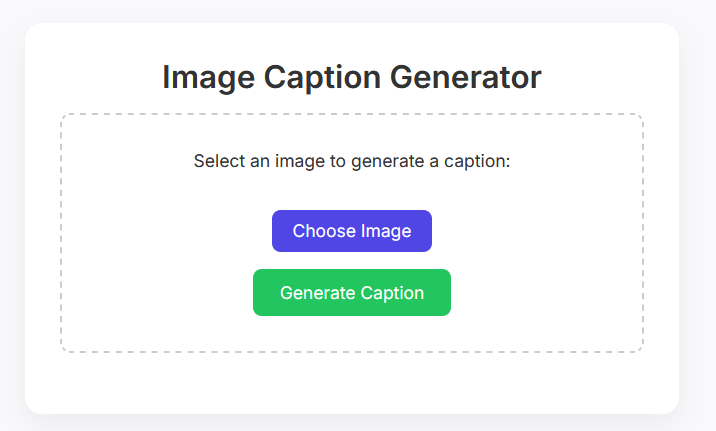
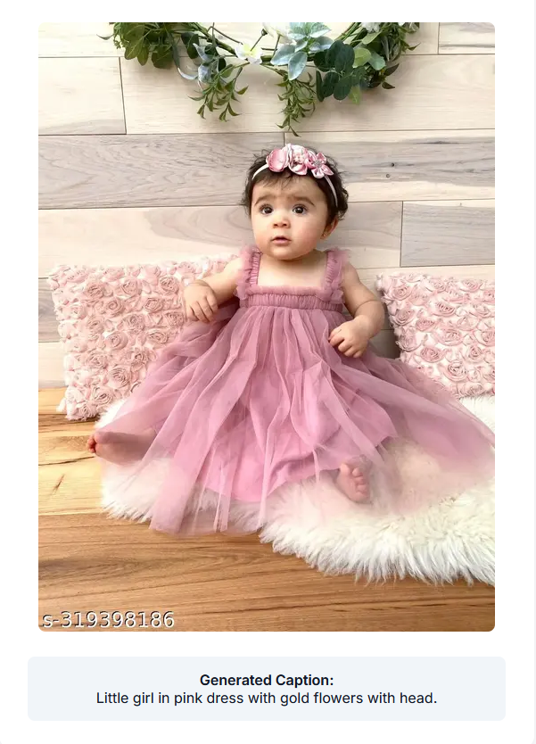

# 🖼️ Image Caption Generator (Flask + TensorFlow)

This is a simple web application built using **Flask** that generates captions for images using a deep learning model. Upload any image and the app will describe what's in it!

## ✨ Features

- Upload an image through a sleek web interface
- Generate a caption using a pre-trained TensorFlow model
- Simple and responsive UI
- Lightweight and easy to deploy

---

## 📸 Preview

### Input Image


### Generated Caption Output



## 📁 Project Structure

```
D:\Projects\Image captioning\
│
├── app.py                  # Flask app entry point
├── utils.py                # Helper functions (load model, generate caption)
│
├── model2\
│   ├──tokenizer.pkl        # Tokenizer used during training
|   |── best_model.keras    # Model
|   ├──.ipynb_checkpoints/
|   ├── Diagrams/
|   ├── Base.png
|   ├── best_model.keras
|   ├── image-to-caption-generator.ipynb
|   └── output.png
│
├── static\
│   └── uploads\            # (Create this folder) Where uploaded images are stored
│
└── templates\
    └── index.html          # Frontend interface
```

---

## 🔧 Installation & Setup

1. **Clone the repository** or download the source files.

2. Create and activate a virtual environment (**Optional**):

   ```bash
   conda create -n caption-env python=3.10
   conda activate caption-env
   ```

3. **Install required libraries**:

   ```bash
   pip install tensorflow flask numpy pillow matplotlib
   ```

4. **Create the upload directory**:

   ```bash
   mkdir -p static/uploads
   ```

5. **Run the Flask app**:

   ```bash
   python app.py
   ```

6. Open your browser and visit:
   [http://127.0.0.1:5000](http://127.0.0.1:5000)

---

## 📸 Sample Usage

1. Upload an image (JPG/PNG)
2. Click **Generate Caption**
3. The app will display the predicted caption below the image

---

## 🛠 Requirements

- Python 3.8+
- TensorFlow
- Flask
- Pillow
- NumPy
- Matplotlib

---

## 🚀 Deployment Options

You can deploy this project using platforms like:

- [Render](https://render.com) — Easy and free tier available
- [Replit](https://replit.com/) — One-click online IDE with hosting
- [Ngrok](https://ngrok.com/) or [LocalTunnel](https://theboroer.github.io/localtunnel-www/) — For local server sharing

---

## 🙌 Acknowledgements

- [TensorFlow](https://www.tensorflow.org/)
- [Flask](https://flask.palletsprojects.com/)

---
